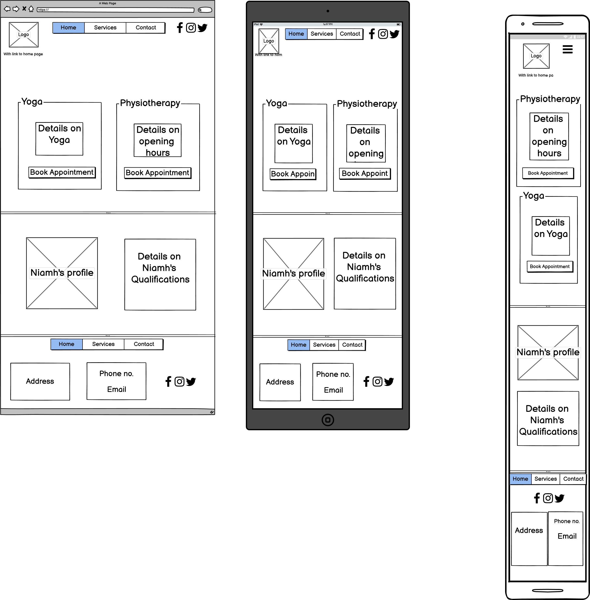

# Niamh Canning Physiotherapy
At the moment Niamh Canning is a small part-time business, she relies on word of mouth from current physiotherapy clients and her Yoga classes.  Currently, she has a following on Instagram but is looking to branch out and allow her business to expand. 
To do this she has decided to increase her online presence.  The website will allow users more information on the business and what is offered by Niamh Canning Physiotherapy, therefore putting the business on a broader platform.

## UX
The website is aimed at people who have been recommended to avail of Physiotherapy, as a registered Physiotherapist, Niamh offers many services to aid the recovery of clients, including Yoga, which will be advertised on the website.

This site is primarily Business to Customer motivated, focusing on reaching out to new and prospective customers.  Most people have an idea of what physiotherapy is or a general idea of it, especially if they have searched for it on the internet, and found the site.  As a B2C website, the user needs very little planning, or incentive compared to a business to business.  

The site will prove the validity of Niamh’s credentials in both the field of Yoga and Physiotherapy, as well as brief overviews of the services on offer, with attractive and simple layouts as users make their decision on the first few visits.  Their reasoning behind choosing this business may be as basic as because this website is attractive and easy to navigate, this must mean they have the revenue and interest -from customers- to invest in a good website, therefore they must be legitimate.

**The main opportunities that the website will provide are as follows:**
- Create a greater online presence
- Increase brand awareness
- A cost-effective way to reach a bigger audience
- Increase sales, through online remote consultations during Covid-19
- Build customer trust, opportunity to showcase what the business is all about.

**Wireframes**

#### User stories

As a person who is looking to avail of Physiotherapy sessions:
1. I want to find out more about the services on offer from the business and have it clearly defined when I first enter the website.
2. The website should be easy to navigate.
3. Easily able to book an appointment with Niamh within the first few clicks of the website, as I already know I want to book a session and don’t need information on the services.
4. Information of the opening hours, email address, phone number, and a map of the destination, so that I can book a time around my schedule and talk to Niamh about my session or find out more about her if need be.
5. To be able to book in for both a Physiotherapy session and a Yoga class, without having to enter my details in twice.

#### Design Choices
- The look of the website was created for the client to be calmed and trusting of the capabilities of the business.  The mainly white colour scheme is used primarily due to the links between white and the medical field, clean, fresh, and cool.
- The colour of the logo was previously chosen by the client for the Instagram page, following through with the same colour scheme keeps the links between social media and the website.  Which allows existing customers to know that the business is the same.
- Having the information about the services on offer on the home page is to encourage the users to book in within the first few steps, having the knowledge they need straight away.

## Features
#### Existing Features
- Services Gallery- This feature allows the user to learn more about each service on offer in image form so that they can relate the technical terms to a layman's concept.
- Social media links- The user can see more information on the Yoga aspect of the business through Instagram.  While Facebook and Twitter link to prospective future social media pages.

#### Features to be implemented in the future:
- A ‘book appointment’ button in the header of each page colour it green or the theme colour to make it stand out.
- Allow returning customer's details to be saved for easy scheduling of a session.
- Add relevant links to the social media of Facebook and Twitter once the client has them running.

#### Features Left to Implement
The Website isn't finished up to the standard as desired, but these are the features that were planned to finish the website:
- The booking form on the contact page
- Interactive Map on the contact page.
- Image of Niamh and information on her qualifications
- Add information on the services offered below the gallery.
- Beautify and organise the Business hours and the ‘Cards’ on the Home page.

## Technologies Used
The **Library** that was used:
- https://getbootstrap.com/
    - The project uses Bootstrap on the Index page to create the Physiotherapy and Yoga ‘Cards’ for info & booking links for the services.
    - It is also used on the services page to align the gallery of images and create the overlay.
#### Testing

##### User Stories fulfillment:
1. **The website should be easy to navigate.**
    - The Logo also enables the user to navigate back to the home page.
    - The social media links open up a new tab to allow the user to easily return to the website.
    - On the Services page, the user is clearly prompted to click on the pictures, which links them to more information.
2. **I want to find out more about the services on offer from the business and have it clearly defined when I first enter the website.**
    - The Navigation bar clearly defines ‘services’ which will take you to a Gallery prompting the user to click on the relevant image.  Upon clicking the image a link will take you further down the page where there is information on the service.
3. **Easily able to book an appointment with Niamh within the first few clicks of the website, as I already know I want to book a session and don’t need information on the services.**
    - The Home page offers a prompting button ‘Book Appointment’ which transfers the user to the Contact page to fill in an appointment form.
    - The user can click the Contact button on any page, to transfer to the appointment form.
4. **Information of the opening hours, email address, phone number, and a map of the destination, so that I can book a time around my schedule and talk to Niamh about my session or find out more about her if need be.**
    - The Contact page holds all the information needed to contact Niamh and/or find the office space.
    - The Appointment form on the Contact page also will have in the future a calendar input to select an appointment date and times.
    - On the Home page, the first content seen is information on yoga and Physiotherapy, below there are buttons to access more details on the opening hours.
5. **To be able to book in for both a Physiotherapy session and a Yoga class, without having to enter my details in twice.**
    - The form has a checkbox to allow the user to choose either one session or both.

#### Testing Process
1. **Hyperlinks:**
    - Navigation links clicked and transferred to the right pages on each page.
    - Social media links in the header and footer open up a new tab to the relevant web pages.
    - The logo transfers back to the home page and when at the home page it merely refreshes the page.
    - On the Services page each of the images, link to the right sections of the page.
2. **Mobile-first design:**
Resize the screen using the inspect option.
    Home page:
    - On each screen size, the navigation bar gets smaller and eventually turns into a burger menu on the mobile size.  The ‘Cards resize then move below each other.
    Services page:
    - On the tablet version the images get smaller, then on the phone version, the images can be viewed in a vertical alignment, one below the other.
    Contact page:
    - Currently, the Contact page doesn’t respond to the screen size, but this will hope to be rectified in the future.
 
 
#### HTML Validator
- The expected outcome of the validation is to return with some errors.
- I tested the site by entering the published site into the [W3 Validator](https://validator.w3.org/) 
- There were no errors on the services page.  
- The Home page had an empty heading and a placeholder attribute within an input element.
    - Fix- Enter text into the heading and change the input element into an <a> element with the same class.
- The Contact page also had a placeholder attribute within the input element, which isn’t used in an input element.
    - Fix- Delete the placeholder attribute.

## Deployment
When creating the code the process of regular updates to the repository is needed, which is completed in the Command line Interface below are the steps taken to do so:
1. Enter git add (Enter the web page to be updated)
2. Git commit -m “Reason for edit”
3. Git push

To deploy this website project from Github repository to Github Pages the following steps were taken:
1. Log into Github
2. Search Github repositories for milestone_one_project and click
3. On the Menu below the title reading ‘emurphy7233/milestone_one_project’ click the settings.
4. Scroll down to Github Pages.
5. Under Source click the drop-down menu and select Master.
6. Once this is done the page is refreshed and the website is deployed.
7. Scroll back to Github pages to retrieve the deployed URL.

At the time of deployment, the development version and the deployed version are both identical.
 
## Credits
#### Referenced Code
- Bootstrap stylesheet link, jquery & CDN referenced in the header on each page.
- Font Awesome stylesheet link referenced in the header on each page.
- Index Page
    - Bootstrap ‘Card deck’ 
    - Font Awesome logos within the Card deck
- Footer
    - The container for the footer contained 'breakpoints’ which was referenced from Bootstrap. 

#### Media
- [Woman doing Yoga pose](https://www.pickpik.com/yoga-woman-nature-landscape-meditate-meditation-2677)
- [Postoperative Physiotherapy](https://www.pxfuel.com/en/free-photo-jqqfh) 
- [Postural Assessment](https://www.pxfuel.com/en/search?q=physiotherapy) 
- [Physiotherapy](http://kimscop.org/) 
- [Acupuncture](https://www.southportosteopathy.com/treatments/acupuncture/) 
- [Sports Massage](https://www.pxfuel.com/en/free-photo-xzmbs) (flipped by a coder for for better flow in the Gallery images)
- [Social media logos](https://fontawesome.com/v4.7.0/icons/) 

#### Acknowledgments
When researching this project I found inspiration in the following list of websites:

- [Physios Online](https://physiosonline.co.uk/)
- [Absoulute Physio](https://www.absolute.physio/)
- [One 2 One Physiotherapy](https://www.one2onephysiotherapy.co.uk/)
- [Physio Focus NI](https://www.physiofocusni.com/)
